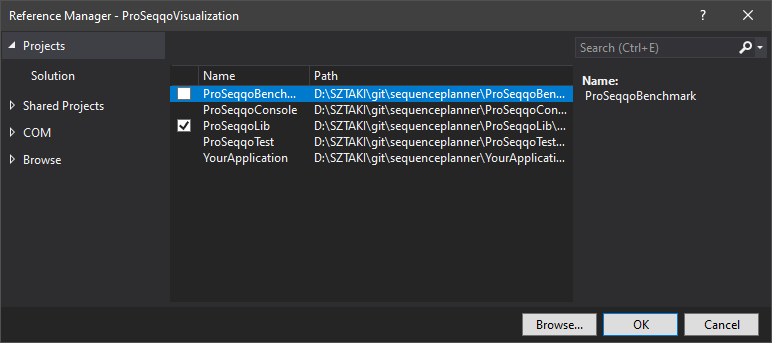

#  [ProSeqqo](../Documentation/Readme.md) 

## Install guide

### Command-line interface
1. Download the latest release and unzip.  
2. Open `cmd` or `PowerShell` and navigate to root directory.  
:crystal_ball: *Shortcut: Windows Explorer -> Adress bar -> `cmd`/`powershell` -> Enter*  <br/>

3. Try:  
```H:\SZTAKI\git\SeqPlanner>Seqencer.exe -h```<br>
```H:\SZTAKI\git\SeqPlanner>Seqencer.exe -i example/test.txt```<br>
```H:\SZTAKI\git\SeqPlanner>Seqencer.exe -i example/test.txt -o example/test_out.txt```<br>

4. [HelloWorld and CLI arguments](../Example/HelloWorld)  
5. [Examples](../Example)  

### DLL
1. Download the latest release and unzip.  
2. Open your VisualStudio Solution
3. Solution Explorer, right-click on your project, add COM/Project/Shared Project Reference
4. Browse SequencePlanner.dll and put a tick.  
5. Use SequencePlanner. 
6. [HelloWorld, methods and properties](../Example/HelloWorld)  
7. [Examples](../Example)  


### Code
1.  Clone the repository from the master branch (use release tags) of the latest.
2.  Open the VisualStudio Solution and add your new project.
3.  Solution Explorer, right-click on your project, add Project Reference.
4.  Add SequencePlanner.
5.  Customize SequencePlanner and use.
6. [HelloWorld, methods and properties](../Example/HelloWorld)  
7. [Examples](../Example)  



###  Docker


