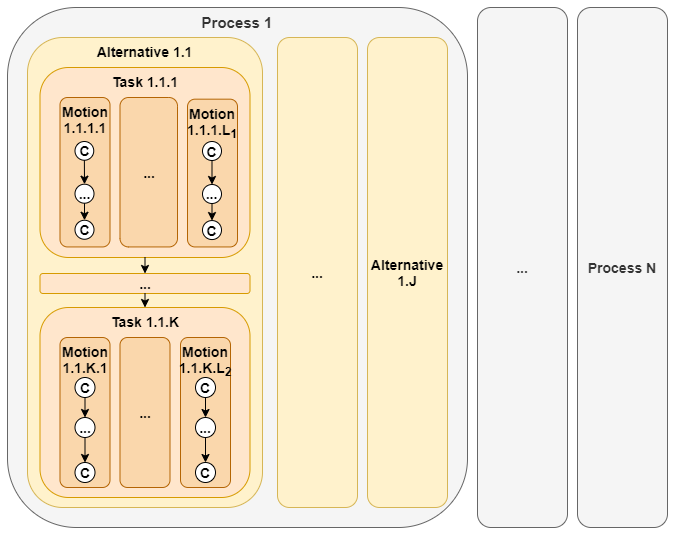

#  ProSeqqo 
[Installation](../Documentation/Install.md)  
[Hello World!](../Example/HelloWorld)  
[Task definition](../Documentation/TaskDefinition.md)  
[Result description](../Documentation/ResultDefinition.md)  
[Examples](../Example)  
[Skeletons](../Example/Skeletons)  
[Papers](../Documentation/Papers)  
[Presentation](../Documentation/20220218_EPIC_Training_Robotics_ZL_public.pdf)

## About
Generic task sequencer that captures typical sequencing problems encountered in robot applications.
* Easily integrated into complex solution workflows
* Standalone exe with file interface (.seq, .json, .xml), .dll function calls, ~~Docker contained REST~~
* Provides close-to-optimal (but not necessarily optimal) solutions quickly
* Compact solver based on an open-source VRP solver engine - Google-OR-Tools
* Arbitrary dimension - 2D, 3D or robotic joint space planning
* Build in cost functions - Euclidian, Max, Manhattan, Trapezoid Time, Matrix
* General description language to describe sequencing problems
* Order constraints
* Resource handling

Visual Studio 2019 Solution:
*  ProSeqqoLib - .NET 5.0 Class Library
*  ProSeqqoConsole - .NET 5.0 Console Application
*  ProSeqqoTest   - .NET 5.0 MSTest Framework Application
*  ProSeqqoVisualization   - .NET 5.0 WPF Application
*  Example
*  Example/HelloWorld
*  Example/Skeletons
*  ~~*  ProSeqqoWebService - ASP.NET 5.0 REST Web Service~~

## Representation
Configurations defined in task space or robot configuration space, in arbitrary dimensions.
These configurations filled into a hierarchy, every configuration take place in a `Motion`, `Task`, `Alternative` and `Process`.
The distance between the configurations can be defined by a matrix or calculated automatically with the selected function.
The result of the execution is a list of Positions corresponds to the following: 
- **Each** of the n **Processes** has to be executed
- by selecting **one** of the given **Alternatives**…
- And executing **every Task** of the alternative…
- By visiting every **Configuration** of **one** possible **Motion** of the given task.

The given task translated to a general travelling salesman (GTSP) graph as an input of the Google-OR-Tools VRP solver.  
Parameters and description language available [here](../Documentation/TaskDefinition.md) and result description is [here](../Documentation/ResultDefinition.md).  

#### Side constraints:
-  Precedence constraints between Motions
-  Precedence constraints between Processes
-  Only one motion used in a task (Disjunctive constraint, generated automatically)
-  Only one alternative used in a process (Disjunctive constraint, generated automatically)

#### Features:
-  Cyclic and uncyclic sequences with optional start and finish configuration. 
-  Automatic cost computation - Euclidian, Max, Manhattan, Trapezoid time
-  Arbitary costs by matrix
-  Penalty for tool path or motion interruption.
-  Resource and resource changeover cost handling.
-  Metaheuristic configuration and time limit for VRP solver by OR-Tools.

## Install:
- Standalone executable
- Dynamic Link Library (DLL)
- Visual Studio 2019 Solution
- <del>Docker Container - REST API</del>

Installation details are available [here](../Documentation/Install.md).

## Examples:
- Camera based pick and place
- Cube pick and place with multiple grasp configuration and many order costraints
- Robotic drawing
- Laser engraving
- Three step grinding of furniture parts  

Hello World! available [here](../Example/HelloWorld).   
Examples and description available [here](../Example).  
Code and file skeletons [here](../Example/Skeletons).  

## Documentation:
Documentation is [here](../Documentation).

## Contributing:
If you find any bugs, please report them! I am also happy to accept pull requests from anyone. 
You can use the issue tracker to report bugs, ask questions, suggest new features or personally: 
Kovács András - kovacs.andras@sztaki.hu 
Zahorán László - zahoran.laszlo@sztaki.hu  
[License](../LICENSE)
