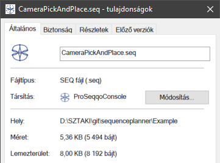

#  [ProSeqqo](../../Documentation/Readme.md) 

## Install guide
## 1. Installation
Installation details are available [here](../../Documentation/Install.md).

## 2.A Run with ProSeqqo Console
Hello World! files available in [Example/HelloWorld](../Example/HelloWorld) directory.

Open ProSeqqo console application in 'cmd' or 'PowerShell'  
`/ProSeqqo> ProSeqqoConsole.exe -i <path>/Example/HelloWorld/HelloWorld.seq`  
`/ProSeqqo> ProSeqqoConsole.exe -i <path>/Example/HelloWorld/HelloWorld.json`  
`/ProSeqqo> ProSeqqoConsole.exe -i <path>/Example/HelloWorld/HelloWorld.xml`  

Couple .seq file extension to ProSeqqoConsole.exe and run by click.  
In this case the result will be placed in same path, with _out postfix in .json format.  


### Console arguments
ProSeqqoConsole project of the solution builds an executable, with the following parameters easy to run written or serialized tasks.

Command-line arguments:

| Command | Shortcut |   Parameter   |                         Comment                       |
|:-------:|:--------:|:-------------:|:-----------------------------------------------------:|
|  -help  |    -h    |               | In case of empty parameter list this command          |
|   -in   |    -i    |  <input path> |         Input task .seq .txt .json .xml               |
|   -out  |    -o    | <output path> |         Outpot task .seq .txt .json .XML              |
|  -conver|    -c    | -i -o         |         Convert task format -i to -o                  |
|   -log  |    -l    |     Trace     | Loglevel                                              |
|         |          |     Debug     |                                                       |
|         |          |      Info     | Default                                               |
|         |          |    Warning    |                                                       |
|         |          |     Error     |                                                       |
|         |          |    Critical   |                                                       |
|         |          |      Off      |                                                       |
| -version|    -v    |               | Version info                                          |

## 2.B Read file and solve wiht .dll or code reuse.
Import ProSeqqoLibrary.dll or ProSeqqoLibrary project in Visual Studio.  
Import namespaces:  
`ProSeqqoLib.GTSPTask.Serialization.Task`  
`ProSeqqoLib.Task`  

```
var ser = new GeneralTaskSerializer();
var task = ser.ImportSEQ("HelloWorld.seq");
var result = task.Run();
```

Example in [YourApplication](../../YourApplication/Program.cs)

## 2.C Build task in code and run.

Import ProSeqqoLib.dll or ProSeqqoLib project in Visual Studio.  
Import namespaces:  
`ProSeqqoLib.GTSPTask.Serialization.Task`  
`ProSeqqoLib.Task`  

The properies, parameter of the code built tasks available at the Details, using section of the [Task definition language](../../Documentation/TaskDefinition.md) page and example is in [YourApplication](../../YourApplication/Program.cs)
```
GeneralTask t = new GeneralTask();
SeqLogger.LogLevel = LogLevel.Info;
t.Cyclic = false;
t.Validate = true;
t.StartDepotConfig  = new Config() { ID = 100, Name = "Start",  Configuration = new List<double>() {0, 0} }; 
t.FinishDepotConfig = new Config() { ID = 200, Name = "Finish", Configuration = new List<double>() {10, 10} };
t.SolverSettings.Metaheuristics = SequencePlanner.Helper.Metaheuristics.GuidedLocalSearch;
t.SolverSettings.TimeLimit = 1000;
t.SolverSettings.UseMIPprecedenceSolver = true;
t.SolverSettings.UseShortcutInAlternatives = true;
t.Validate = true;
t.Hierarchy.HierarchyRecords.AddRange(CreateHierarchy(t));
var result =  t.Run();
```

