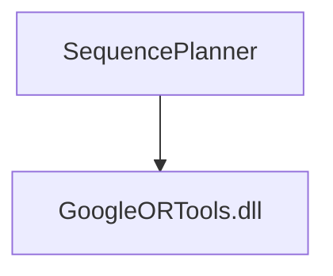

SequencePlanner
======

## About

Generic task sequencer that captures typical sequencing problems encountered in robot applications.
* Easily integrated into complex solution workflows
* Standalone exe with file interface or DLL function calls
* Provides close-to-optimal (but not necessarily optimal) solutions quickly, e.g., in <1 sec for typical cases
* Compact solver based on an open source VRP solver engine - Google-OR-Tools

:earth_americas: [Wiki](https://git.sztaki.hu/zahoranl/sequenceplanner/-/wikis/home) 
:clipboard: [Snippets](https://git.sztaki.hu/zahoranl/sequenceplanner/snippets) 

#### Semantics: 
- **Each** of the n **Processes** has to be executed
- by selecting **one** of the given **Alternatives**…
- And executing **every Task** of the alternative…
- By visiting **one** possible **Position** of the given task.

#### Positions:
- Defined in task space or robot configuration space, in arbitrary dimensions
- Distances (time or space) between them can be calculated using some function

#### Side constraints:
-  Precedence constraints between Processes
-  Precedence constraints between Positions

#### Abstraction:
**Nodes** → Positions \
**Classes** → Set of all positions of a task, union over all alternatives of a process\
**Edges** → From every position of a task to every position of the next task of the same alternative. From every position of the last task of an alternative to every position of the first task of all other processes \
**Edge weights** → Implemented common distance functions (e.g., max, Euclidean, trapezoid speed, etc.). Distance matrix (in case of complex paths between positions).

 

Installation:
------

>  Under heavy development
¯\＿(ツ)＿/¯

Dependency graph:

Documentation:
------

Contributing:
------
If you find any bugs, please report them! I am also happy to accept pull requests from anyone. 
You can use the [GitLab issue tracker](https://git.sztaki.hu/zahoranl/pathplanner/issues) to report bugs, ask questions, suggest new features or personally: 
Kovács András - kovacs.andras@sztaki.hu 
Zahorán László - zahoran.laszlo@sztaki.hu