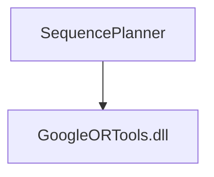

SequencePlanner
======

:earth_americas: [Wiki](https://git.sztaki.hu/zahoranl/sequenceplanner/-/wikis/home) 
:clipboard: [Snippets](https://git.sztaki.hu/zahoranl/sequenceplanner/snippets) 

Installation:
------

Dependency graph:

Documentation:
------

Contributing:
------
If you find any bugs, please report them! I am also happy to accept pull requests from anyone. 
You can use the [GitLab issue tracker](https://git.sztaki.hu/zahoranl/pathplanner/issues) to report bugs, ask questions, suggest new features or personally: 
Kovács András - kovacs.andras@sztaki.hu 
Zahorán László - zahoran.laszlo@sztaki.hu